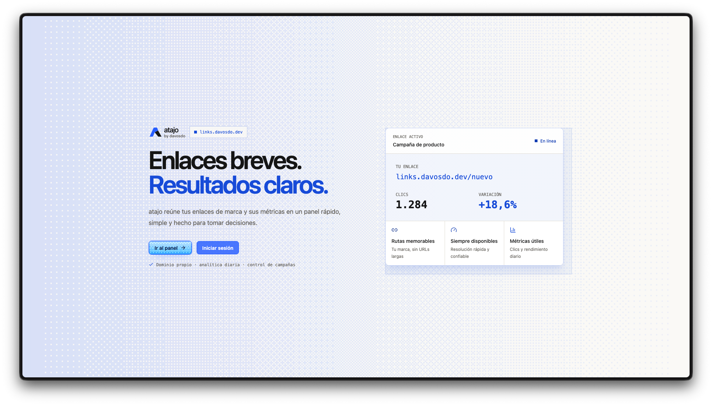
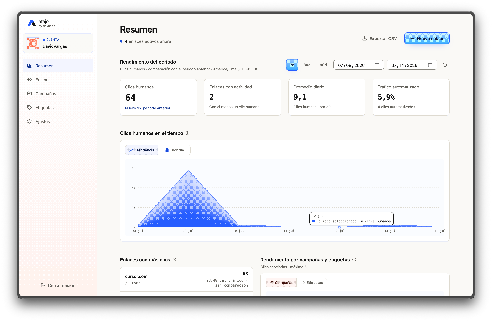

<p align="center">
  
</p>

# atajo

**atajo by davosdo** — _La ruta corta._

atajo is a self-hosted, Cloudflare-native URL shortener. The public product uses
the **atajo** brand, while `davos-links` remains the technical name of the project
and its infrastructure.

## Screenshots

### Landing page



### Analytics dashboard



## Features

- Create, edit, activate, deactivate, and archive short links.
- Configurable public paths with reserved-name validation.
- Protected dashboard with email and password authentication.
- Organization through tags and campaigns.
- Overall and per-link analytics with period comparisons.
- Breakdowns by country, referrer, and device.
- CSV analytics exports.
- Fast link resolution through KV, with D1 as the canonical data source.
- Click telemetry through Workers Analytics Engine without blocking redirects.

## Stack

- TanStack Start, TanStack Router, React, and TypeScript
- Tailwind CSS
- Cloudflare Workers
- Cloudflare D1
- Cloudflare KV
- Cloudflare Workers Analytics Engine
- Better Auth
- Wrangler

## Requirements

Before getting started, you need:

- A Node.js version compatible with the project dependencies.
- [pnpm](https://pnpm.io/) 11 or later.
- A Cloudflare account with access to Workers.
- Wrangler authenticated through `pnpm exec wrangler login`.
- A D1 database.
- A KV namespace.
- A Workers Analytics Engine dataset.
- A domain or subdomain routed to the Worker for production.

## Architecture

D1 stores the canonical authentication, workspace, domain, link, tag, campaign,
API key, and daily metrics data. KV keeps compact payloads for resolving
redirects under the `link:${host}:${short_path_normalized}` key.

The public redirect flow is:

1. Parse and normalize the requested host and path.
2. Reject internal or reserved paths.
3. Look up the link in KV.
4. Query D1 when no cached entry exists.
5. Cache active links in KV with a TTL.
6. Respect inactive, archived, and expired links and their fallback behavior.
7. Record telemetry with `ctx.waitUntil()`.
8. Respond using the redirect type configured for the link.

The dashboard consumes protected `/api/*` routes. Cloudflare bindings and the
Better Auth session remain exclusively on the server.

## Configuration

### 1. Install dependencies

```bash
pnpm install
```

### 2. Create the Cloudflare resources

You can create them from the Cloudflare dashboard or with Wrangler:

```bash
pnpm exec wrangler d1 create <D1_DATABASE_NAME>
pnpm exec wrangler kv namespace create <KV_NAMESPACE_NAME>
```

Analytics Engine creates the dataset when the Worker starts writing data; you
only need to declare a dataset name in `wrangler.jsonc`.

### 3. Configure `wrangler.jsonc`

Replace the values from the installation included in the repository with those
from your environment:

```jsonc
{
  "name": "<WORKER_NAME>",
  "vars": {
    "BETTER_AUTH_URL": "https://<YOUR_DOMAIN>",
    "CLOUDFLARE_ACCOUNT_ID": "<CLOUDFLARE_ACCOUNT_ID>"
  },
  "d1_databases": [
    {
      "binding": "LINKS_DB",
      "database_name": "<D1_DATABASE_NAME>",
      "database_id": "<D1_DATABASE_ID>",
      "migrations_dir": "migrations"
    }
  ],
  "kv_namespaces": [
    {
      "binding": "SHORT_LINK_CACHE",
      "id": "<KV_NAMESPACE_ID>"
    }
  ],
  "analytics_engine_datasets": [
    {
      "binding": "CLICK_ANALYTICS",
      "dataset": "<ANALYTICS_ENGINE_DATASET>"
    }
  ]
}
```

Do not rename the bindings without updating the code and generated types as
well. If you use a different D1 database name, update the `db:migrate`,
`db:migrate:local`, and `db:seed-demo:local` scripts, which currently point to
the repository's default technical name.

### 4. Configure local variables

Copy the example file:

```bash
cp .dev.vars.example .dev.vars
```

Configure `.dev.vars` without committing it to version control:

```dotenv
BETTER_AUTH_SECRET="<RANDOM_SECRET>"
BETTER_AUTH_URL="http://localhost:3000"
ANALYTICS_DATA_SOURCE="demo"

# Required to query Analytics Engine instead of demo data.
CLOUDFLARE_ACCOUNT_ID="<CLOUDFLARE_ACCOUNT_ID>"
ANALYTICS_ENGINE_API_TOKEN="<ANALYTICS_ENGINE_API_TOKEN>"
```

| Variable or binding | Purpose | Required |
| --- | --- | --- |
| `LINKS_DB` | Canonical application data and Better Auth database in D1. | Always |
| `SHORT_LINK_CACHE` | KV cache for public redirects. | Always |
| `CLICK_ANALYTICS` | Analytics Engine event writes. | Always |
| `BETTER_AUTH_SECRET` | Signs and protects sessions. It must be a strong random secret. | Always; store as a production secret |
| `BETTER_AUTH_URL` | Public origin for the application and Better Auth. | Always |
| `ANALYTICS_DATA_SOURCE` | Use `demo` for local breakdowns; any other value queries Analytics Engine. | Optional; recommended locally |
| `CLOUDFLARE_ACCOUNT_ID` | Account used to query the Analytics Engine API. | Real analytics only |
| `ANALYTICS_ENGINE_API_TOKEN` | Token with Account Analytics read access. | Real analytics only; store as a secret |

`demo` mode is only allowed on local origins and reads seeded breakdowns from
D1. Dashboard totals and time series are also calculated from D1.

### 5. Adapt the domain and default data

This version still retains some values from the original installation outside
`wrangler.jsonc`. Before deploying your own instance, review:

- `src/lib/constants.ts`: public origin, domain, workspace, and default domain.
- `src/lib/auth/server.ts`: `trustedOrigins`, local fallback, and cookie prefix.
- `migrations/0001_initial_schema.sql`: initially inserted workspace and domain.
- `scripts/seed-demo-local.mjs` and `scripts/seed-demo-data.sql`: demo user and content.

Use the same host in `BETTER_AUTH_URL`, trusted origins, the default domain, and
the Worker's production route.

### 6. Prepare and run the local environment

```bash
pnpm cf-typegen
pnpm db:migrate:local
pnpm db:seed-demo:local
pnpm dev
```

The seed script creates a local user and prints its credentials in the terminal.
Change them in the script before running it if you do not want to use the demo
values included in the repository.

## Authentication and initial user

Better Auth is served at `/api/auth/*`. Email and password sign-in is enabled,
but public registration is disabled. You must therefore intentionally create at
least one user through one of these methods:

- Run `pnpm db:seed-demo:local` for local development.
- Adapt the seed script to create your own credentials.
- Insert a user and credential account through a secure administrative process
  that generates a Better Auth-compatible hash.

Do not copy demo users to production or store passwords in plain text.

## Scripts

| Command | Description |
| --- | --- |
| `pnpm dev` | Start the Vite development server. |
| `pnpm generate-routes` | Regenerate the TanStack Router route tree. |
| `pnpm typecheck` | Run TypeScript without emitting files. |
| `pnpm build` | Build the application and run strict type checking. |
| `pnpm preview` | Preview the build locally. |
| `pnpm test` | Run Vitest with coverage. |
| `pnpm test:watch` | Run Vitest in interactive mode. |
| `pnpm deploy` | Build and deploy the Worker with Wrangler. |
| `pnpm cf-typegen` | Regenerate Cloudflare binding types. |
| `pnpm db:migrate:local` | Apply D1 migrations locally. |
| `pnpm db:seed-demo:local` | Create the local demo user and data. |
| `pnpm db:migrate` | Apply migrations to the remote D1 database. |
| `pnpm ui:detect` | Run the Impeccable visual detector. |

Run `pnpm generate-routes` after adding or changing routes.

## Main routes

### Application

- `/`: public landing page.
- `/login`: sign-in page.
- `/dashboard`: activity overview.
- `/dashboard/links`: link list.
- `/dashboard/links/new`: link creation.
- `/dashboard/links/:id`: link details and analytics.
- `/dashboard/links/:id/edit`: link editing.
- `/dashboard/tags`: tag management.
- `/dashboard/campaigns`: campaign management.
- `/dashboard/settings`: settings.
- `/:shortPath`: public redirect.

### API

- `/api/auth/*`
- `/api/links`, `/api/links/check-path`, and `/api/links/:id`
- `/api/links/:id/disable` and `/api/links/:id/archive`
- `/api/links/:id/tags` and `/api/links/:id/campaigns`
- `/api/links/:id/analytics`
- `/api/tags` and `/api/tags/:id`
- `/api/campaigns` and `/api/campaigns/:id`
- `/api/analytics/overview`
- `/api/analytics/export.csv`
- `/health`

The paths `dashboard`, `api`, `health`, `assets`, `_build`, `_static`,
`favicon.ico`, `robots.txt`, `sitemap.xml`, `login`, `logout`, `register`,
`settings`, `admin`, and `app` cannot be used as short paths. Paths beginning
with `dashboard/`, `api/`, `assets/`, `_build/`, or `_static/` are also rejected.

## Deployment

1. Configure the domain, D1, KV, and Analytics Engine in `wrangler.jsonc`.
2. Adapt the defaults described in the configuration section.
3. Generate a strong secret and store it in Cloudflare:

   ```bash
   pnpm exec wrangler secret put BETTER_AUTH_SECRET
   ```

4. To query Analytics Engine, create an API token scoped to the account with
   `Account > Account Analytics > Read` permission and store it:

   ```bash
   pnpm exec wrangler secret put ANALYTICS_ENGINE_API_TOKEN
   ```

5. Generate types, migrate D1, validate, and deploy:

   ```bash
   pnpm cf-typegen
   pnpm db:migrate
   pnpm test
   pnpm deploy
   ```

6. Configure the Worker's custom route or domain in Cloudflare, then verify
   `/health`, sign-in, and a redirect before sharing the instance.

## Design and brand

The public identity is **atajo by davosdo**, with the _La ruta corta._ tagline
and a geometric A mark. The interface is light, compact, and developer-tool
oriented, with sans and mono typefaces, warm surfaces, atajo blue, and route
coral. The system maintains WCAG AA contrast, visible focus states, and reduced
motion support.

The Dither Kit subset included in `src/components/dither-kit/` retains its
provenance reference in `src/components/dither-kit/UPSTREAM.md`.

## Current limitations

- Analytics Engine breakdowns are subject to Cloudflare platform retention and
  limits.
- The instance starts with a single default workspace and domain; there is no
  public multi-tenant onboarding flow yet.
- Public registration is disabled, and user creation requires an administrative
  process.
- Changing technical binding or resource names requires coordinated updates to
  the configuration, scripts, and generated types.
